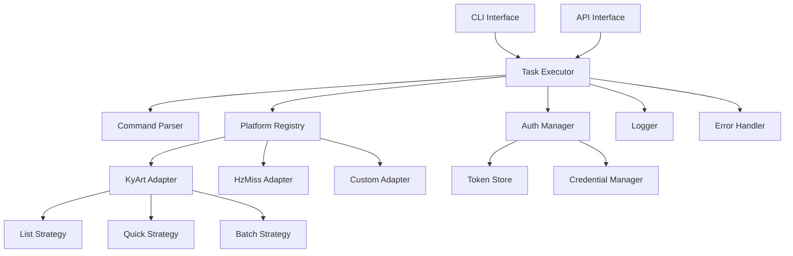
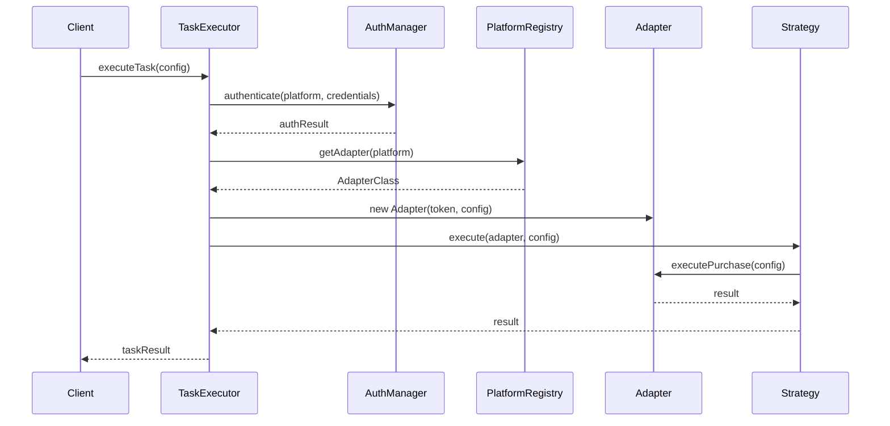
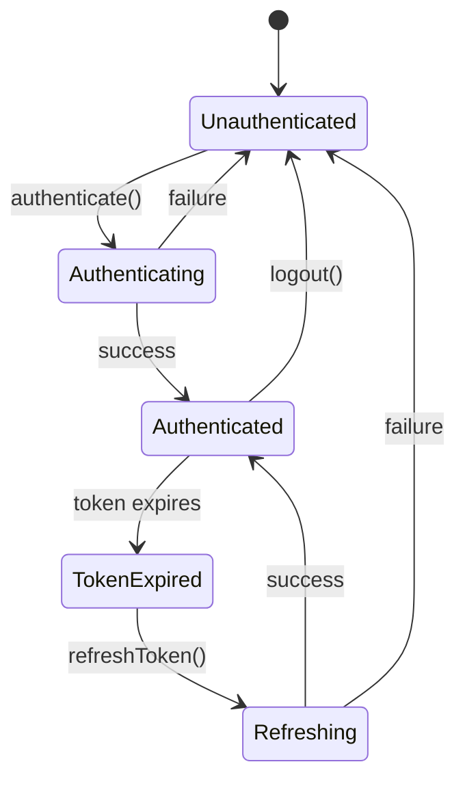
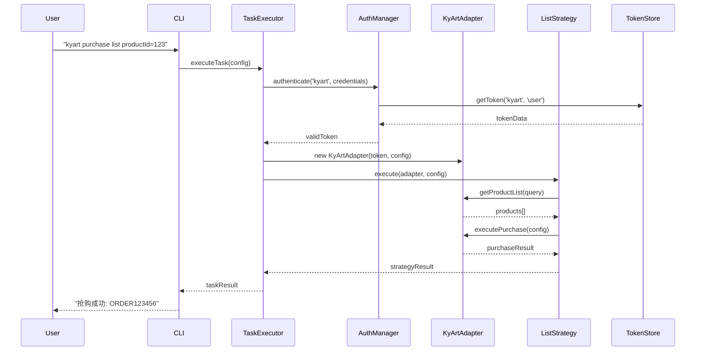
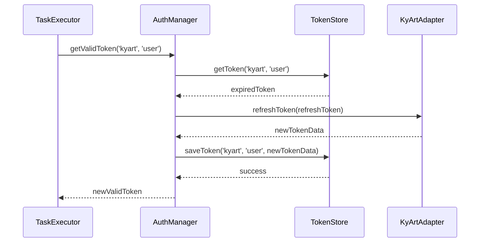

# SmartBuy Framework - 架构设计文档

## 概述

SmartBuy Framework 是一个模块化、可扩展的多平台智能购物自动化框架。本文档详细描述了框架的整体架构设计、核心组件和设计模式。

## 设计原则

### 1. 单一职责原则 (SRP)
每个类和模块都有明确的单一职责：
- `PlatformAdapter`: 负责平台特定的API调用
- `PurchaseStrategy`: 负责抢购策略的执行
- `AuthManager`: 负责认证和Token管理
- `TaskExecutor`: 负责任务的统一执行

### 2. 开放封闭原则 (OCP)
框架对扩展开放，对修改封闭：
- 通过接口和抽象类定义标准
- 新平台通过实现接口来扩展
- 新策略通过继承基类来扩展

### 3. 依赖倒置原则 (DIP)
高层模块不依赖低层模块，都依赖抽象：
- `TaskExecutor`依赖`PlatformAdapter`接口
- `AuthManager`依赖`TokenStore`和`CredentialManager`接口
- 通过依赖注入实现解耦

### 4. 接口隔离原则 (ISP)
接口设计遵循最小化原则：
- 将大接口拆分为多个专门的小接口
- 实现类只需要实现需要的接口

## 整体架构



## 核心组件

### 1. 接口层 (Interface Layer)

#### CLI Interface
- 命令行用户界面
- 解析用户输入的字符串命令
- 提供交互式和批处理模式

#### API Interface  
- 程序化调用接口
- RESTful API风格
- 支持同步和异步调用

### 2. 应用层 (Application Layer)

#### TaskExecutor
任务执行器，框架的核心协调者。

**职责:**
- 接收和解析任务请求
- 协调各个组件完成任务
- 处理异常和重试逻辑
- 提供统一的任务执行接口

**工作流程:**


#### CommandParser
命令解析器，将字符串命令转换为结构化配置。

**解析规则:**
```
<platform> <action> [subAction] [key=value] [key=value] ...

示例:
kyart purchase list productId=123 quantity=2
hzmiss query products keyword=手机 limit=10
```

**解析结果:**
```javascript
{
  platform: 'kyart',
  action: 'purchase',
  subAction: 'list',
  parameters: {
    productId: '123',
    quantity: '2'
  }
}
```

### 3. 业务层 (Business Layer)

#### AuthManager
认证管理器，提供统一的认证和Token管理。

**核心功能:**
- 用户认证和Token获取
- Token生命周期管理
- 自动刷新和重试机制
- 凭据安全存储

**状态管理:**


#### PlatformRegistry
平台注册中心，管理所有平台适配器。

**注册机制:**
```javascript
// 静态注册
PlatformRegistry.register('kyart', KyArtAdapter);

// 动态注册
PlatformRegistry.registerFromConfig({
  name: 'custom',
  adapterPath: './adapters/CustomAdapter',
  config: { /* 平台特定配置 */ }
});
```

### 4. 适配器层 (Adapter Layer)

#### PlatformAdapter 基类
定义所有平台适配器的标准接口。

**核心抽象方法:**
- `login()`: 用户登录
- `getProductList()`: 获取商品列表
- `executePurchase()`: 执行抢购
- `getOrderStatus()`: 查询订单状态
- `processPayment()`: 处理支付
- `cancelOrder()`: 取消订单
- `refreshToken()`: 刷新Token
- `validateConfig()`: 验证配置

**通用功能:**
- HTTP客户端封装
- 请求/响应拦截器
- 错误处理和重试
- 请求签名和认证

#### 具体适配器实现

##### KyArtAdapter
- 支持列表、快捷、批量抢购
- 支持商品合成功能
- 支持订单取消

##### HzMissAdapter  
- 支持多种抢购模式
- 支持商品查询功能
- 定制化的API调用逻辑

### 5. 策略层 (Strategy Layer)

#### PurchaseStrategy 基类
抢购策略的模板方法实现。

**模板方法模式:**
```javascript
class PurchaseStrategy {
  async execute(adapter, config) {
    await this.preProcess(adapter, config);
    const result = await this.performPurchase(adapter, config);
    await this.postProcess(adapter, config, result);
    return result;
  }
  
  // 子类需要实现的抽象方法
  abstract async performPurchase(adapter, config);
}
```

#### 具体策略实现

##### ListPurchaseStrategy
列表模式抢购策略
- 适用于从商品列表中选择商品
- 支持条件筛选和排序
- 支持批量选择

##### QuickPurchaseStrategy  
快捷模式抢购策略
- 适用于已知商品ID的快速抢购
- 最小化请求次数
- 优化响应时间

##### BatchPurchaseStrategy
批量模式抢购策略
- 支持同时抢购多个商品
- 并发控制和错误隔离
- 部分成功处理

### 6. 基础设施层 (Infrastructure Layer)

#### 存储组件

##### TokenStore
Token存储接口，支持多种存储实现：

- **FileTokenStore**: 文件系统存储
- **RedisTokenStore**: Redis存储 (可扩展)
- **DatabaseTokenStore**: 数据库存储 (可扩展)

**存储结构:**
```javascript
{
  platform: 'kyart',
  account: 'user@example.com',
  token: 'access_token_here',
  refreshToken: 'refresh_token_here',
  expiresAt: '2024-01-01T12:00:00.000Z',
  userInfo: { /* 用户信息 */ },
  createdAt: '2024-01-01T10:00:00.000Z',
  lastUsed: '2024-01-01T11:30:00.000Z'
}
```

##### CredentialManager
凭据管理接口，安全存储用户凭据：

- **FileCredentialManager**: 加密文件存储
- 支持AES-256-CBC加密
- 支持凭据验证和生命周期管理

**存储结构:**
```javascript
{
  platform: 'kyart',
  account: 'user@example.com',
  password: '加密后的密码',
  payPassword: '加密后的支付密码',
  phone: '手机号',
  email: '邮箱地址',
  createdAt: '2024-01-01T10:00:00.000Z',
  lastUsed: '2024-01-01T11:30:00.000Z'
}
```

#### 日志系统

##### Logger
统一的日志记录工具：

**日志级别:**
- ERROR: 错误信息
- WARN: 警告信息  
- INFO: 一般信息
- DEBUG: 调试信息

**日志格式:**
```
[2024-01-01 12:00:00] [INFO] [TaskExecutor] 任务执行开始: kyart purchase list
[2024-01-01 12:00:01] [DEBUG] [AuthManager] 获取Token: kyart:user@example.com
[2024-01-01 12:00:02] [INFO] [KyArtAdapter] 抢购成功: ORDER123456
```

#### 错误处理

##### ErrorFactory
标准化错误创建工厂：

**错误类型:**
- SystemError: 系统级错误
- AuthError: 认证相关错误
- APIError: API调用错误
- ValidationError: 参数验证错误
- PurchaseError: 抢购相关错误
- PaymentError: 支付相关错误

**错误结构:**
```javascript
{
  type: 'AUTH_ERROR',
  message: '认证失败，Token已过期',
  code: 'TOKEN_EXPIRED',
  details: {
    platform: 'kyart',
    account: 'user@example.com',
    timestamp: '2024-01-01T12:00:00.000Z'
  },
  stack: '错误堆栈信息'
}
```

## 设计模式应用

### 1. 适配器模式 (Adapter Pattern)
- **应用场景**: 不同平台API的统一调用
- **实现**: PlatformAdapter接口和具体适配器类
- **优势**: 隔离平台差异，提供统一接口

### 2. 策略模式 (Strategy Pattern)  
- **应用场景**: 不同抢购策略的选择和执行
- **实现**: PurchaseStrategy基类和具体策略类
- **优势**: 算法可互换，易于扩展新策略

### 3. 模板方法模式 (Template Method Pattern)
- **应用场景**: 抢购流程的标准化
- **实现**: PurchaseStrategy的execute方法
- **优势**: 定义算法骨架，子类实现具体步骤

### 4. 工厂模式 (Factory Pattern)
- **应用场景**: 错误对象和适配器对象的创建
- **实现**: ErrorFactory和PlatformRegistry
- **优势**: 封装对象创建逻辑，降低耦合

### 5. 单例模式 (Singleton Pattern)
- **应用场景**: 平台注册中心和日志器
- **实现**: PlatformRegistry的静态方法
- **优势**: 全局唯一实例，资源共享

### 6. 观察者模式 (Observer Pattern)
- **应用场景**: 任务执行状态通知
- **实现**: EventEmitter事件系统
- **优势**: 解耦通知机制，支持多订阅者

### 7. 命令模式 (Command Pattern)
- **应用场景**: 用户命令的解析和执行
- **实现**: CommandParser和TaskExecutor
- **优势**: 命令封装，支持撤销和重做

## 数据流

### 1. 典型抢购流程



### 2. Token刷新流程



## 扩展机制

### 1. 新平台扩展
1. 继承PlatformAdapter基类
2. 实现所有抽象方法
3. 创建平台特定配置
4. 注册到PlatformRegistry
5. 创建命令映射文件

### 2. 新策略扩展
1. 继承PurchaseStrategy基类
2. 实现performPurchase方法
3. 注册到StrategyRegistry
4. 更新命令解析规则

### 3. 新存储后端扩展
1. 实现TokenStore或CredentialManager接口
2. 添加必要的配置选项
3. 更新依赖注入配置

### 4. 新认证方式扩展
1. 扩展AuthManager类
2. 添加新的认证流程
3. 更新Token格式和生命周期

## 性能优化

### 1. 缓存策略
- **Token缓存**: 内存缓存有效Token，减少磁盘I/O
- **商品列表缓存**: 缓存商品查询结果，减少API调用
- **配置缓存**: 缓存平台配置，提高启动速度

### 2. 并发控制
- **连接池**: 复用HTTP连接，减少建连开销
- **请求限流**: 控制API调用频率，避免被限制
- **并发抢购**: 支持多商品同时抢购

### 3. 异步处理
- **异步I/O**: 使用Promise和async/await
- **事件驱动**: 基于事件的异步通知机制
- **后台任务**: 支持后台执行长时间任务

## 安全考虑

### 1. 数据加密
- **敏感数据加密**: 密码和Token使用AES-256-CBC加密
- **传输加密**: 强制使用HTTPS协议
- **密钥管理**: 支持环境变量和密钥文件

### 2. 输入验证
- **参数验证**: 严格验证所有用户输入
- **SQL注入防护**: 使用参数化查询
- **XSS防护**: 转义HTML输出

### 3. 访问控制
- **Token验证**: 严格验证Token有效性
- **权限检查**: 基于角色的访问控制
- **审计日志**: 记录所有敏感操作

## 监控和诊断

### 1. 性能监控
- **响应时间**: 监控API调用耗时
- **成功率**: 统计操作成功率
- **错误率**: 监控各类错误的发生频率

### 2. 健康检查
- **组件状态**: 检查各个组件的健康状态
- **依赖服务**: 检查外部依赖的可用性
- **资源使用**: 监控内存和CPU使用情况

### 3. 诊断工具
- **日志分析**: 结构化日志便于分析
- **错误追踪**: 完整的错误堆栈和上下文
- **性能分析**: 支持性能分析和瓶颈识别

## 测试策略

### 1. 单元测试
- **核心逻辑测试**: 测试各个类和方法的功能
- **边界条件测试**: 测试异常情况和边界值
- **Mock测试**: 使用Mock对象隔离依赖

### 2. 集成测试
- **组件集成**: 测试组件间的交互
- **API集成**: 测试与外部API的集成
- **端到端测试**: 测试完整的业务流程

### 3. 性能测试
- **负载测试**: 测试系统在正常负载下的表现
- **压力测试**: 测试系统的极限承受能力
- **并发测试**: 测试多用户并发场景

## 部署架构

### 1. 单机部署
- **独立进程**: 作为独立的Node.js进程运行
- **本地存储**: 使用本地文件系统存储数据
- **适用场景**: 个人使用或小规模使用

### 2. 分布式部署
- **多实例**: 支持多个实例负载均衡
- **共享存储**: 使用Redis或数据库共享状态
- **适用场景**: 企业级使用或高可用需求

### 3. 容器化部署
- **Docker容器**: 提供Docker镜像
- **Kubernetes支持**: 支持K8s部署和扩缩容
- **配置管理**: 使用ConfigMap和Secret管理配置

## 未来规划

### 1. 功能增强
- **智能推荐**: 基于历史数据的商品推荐
- **价格监控**: 商品价格变化监控和通知
- **库存预警**: 商品库存不足预警

### 2. 性能优化
- **缓存优化**: 更智能的缓存策略
- **算法优化**: 优化抢购算法和成功率
- **资源优化**: 减少内存和CPU使用

### 3. 生态建设
- **插件系统**: 支持第三方插件扩展
- **API开放**: 提供完整的REST API
- **社区建设**: 建立开发者社区和文档