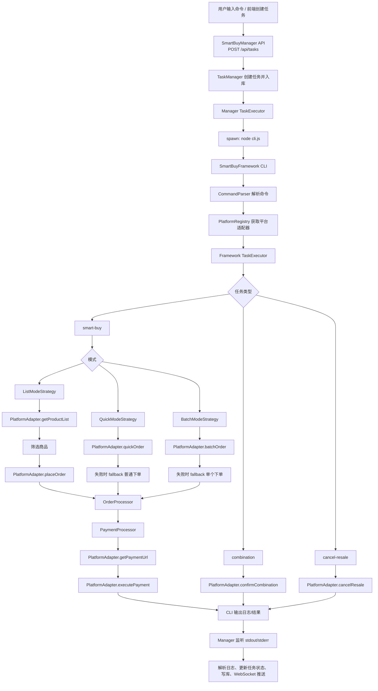

# top-box-v2 架构与接入说明

## 1. 文档目的

这份文档用于从维护者视角梳理 `top-box-v2` 的整体设计、实际执行链路、平台接入方式、功能边界和当前实现状态。

适合以下场景：

- 你想快速回忆 `top-box-v2` 到底是做什么的
- 你准备继续维护这个目录，但一时忘了入口在哪里
- 你想确认 `SmartBuyFramework` 和 `SmartBuyManager` 的关系
- 你想新增平台、补功能、接前端页面，先看清现状再动手

## 2. 项目定位

`top-box-v2` 不是一个单体下单脚本，而是一个二代平台化方案，目标是把原来零散的抢购脚本抽象成：

1. 一个可复用的抢购执行框架
2. 一个可以统一管理任务的 Web 后台

也就是说，它的核心思想是：

- `SmartBuyFramework` 负责“真正执行业务”
- `SmartBuyManager` 负责“管理、调度、监控业务”

和早期脚本版项目相比，`top-box-v2` 更强调：

- 多平台统一接入
- 多任务统一调度
- 命令格式统一
- 策略抽象
- 日志、状态、统计可视化

## 3. 目录结构

```text
top-box-v2/
├── SmartBuyFramework/         # 抢购执行框架
│   ├── cli.js                 # CLI入口
│   ├── main.js                # 框架主入口
│   ├── core/                  # 解析、注册、执行器、策略
│   ├── platforms/             # 平台适配层
│   ├── processors/            # 订单处理、支付处理
│   ├── interfaces/            # 平台接口和认证抽象
│   ├── config/                # 商品配置、间隔配置
│   └── utils/                 # 日志、校验、错误类型
├── SmartBuyManager/           # Web管理后台
│   ├── backend/               # Express + Socket.IO + SQLite
│   ├── frontend/              # React + Vite + Zustand + Antd
│   ├── ecosystem.config.js    # PM2配置
│   └── test-*.js              # 接口/综合测试脚本
└── doc/                       # 文档目录
```

## 4. 两大子系统说明

### 4.1 SmartBuyFramework 是什么

`SmartBuyFramework` 是一个统一的抢购执行引擎。

它的职责是：

- 接收一条字符串命令
- 解析出平台、任务类型、模式、认证信息、商品参数
- 根据平台选择对应适配器
- 根据模式选择对应策略
- 执行下单、轮询、支付、合成确认、取消寄售

它是整个系统的“业务引擎”。

关键入口文件：

- [main.js](/Users/zhangrui2/Desktop/workSpace/ky/top-box-v2/SmartBuyFramework/main.js)
- [cli.js](/Users/zhangrui2/Desktop/workSpace/ky/top-box-v2/SmartBuyFramework/cli.js)

### 4.2 SmartBuyManager 是什么

`SmartBuyManager` 是一个任务管理后台。

它并不直接调用平台接口，而是通过子进程去启动 `SmartBuyFramework`。

它的职责是：

- 提供任务管理 API
- 存储任务、日志、订单、指标到 SQLite
- 启动和停止任务
- 监听框架输出日志
- 将日志解析成任务状态、错误、进度
- 通过 WebSocket 推送给前端

它是整个系统的“调度与监控层”。

关键入口文件：

- [backend/server.js](/Users/zhangrui2/Desktop/workSpace/ky/top-box-v2/SmartBuyManager/backend/server.js)
- [backend/api/routes/tasks.js](/Users/zhangrui2/Desktop/workSpace/ky/top-box-v2/SmartBuyManager/backend/api/routes/tasks.js)

## 5. 整体调用链路

### 5.1 主调用链



### 5.2 这条链路怎么理解

可以把它拆成三层：

1. 任务入口层
   `SmartBuyManager` 接受命令、建任务、调度执行

2. 执行引擎层
   `SmartBuyFramework` 负责解析命令并路由到业务逻辑

3. 平台适配层
   平台适配器负责真正和 `kyart`、`hzmiss` 这类平台 API 交互

## 6. Framework 的详细执行逻辑

## 6.1 框架启动与初始化

框架主入口在：

- [SmartBuyFramework/main.js](/Users/zhangrui2/Desktop/workSpace/ky/top-box-v2/SmartBuyFramework/main.js)

初始化时会做几件事：

1. 初始化商品配置管理器
2. 初始化间隔配置管理器
3. 注册平台适配器
4. 创建统一任务执行器

也就是说，框架不是直接开跑，而是先把配置和平台能力装配好。

## 6.2 命令解析机制

命令解析器在：

- [core/CommandParser.js](/Users/zhangrui2/Desktop/workSpace/ky/top-box-v2/SmartBuyFramework/core/CommandParser.js)

### 支持的命令格式

基础格式：

```text
<平台><任务>-<账号>-<密码或[token]>-<支付密码>-<参数>
```

示例：

```bash
node cli.js ky列表-18812345678-pwd123-pay123-590*5*128
node cli.js ky快捷-18812345678-[uuid-token]-pay123-590*2*100
node cli.js ky合成-18812345678-pwd123-pay123-combo123
node cli.js hz取消-18812345678-[token]-pay123-resale123
```

### 已支持的命令前缀

当前命令映射内置在解析器里：

- `ky列表`
- `ky快捷`
- `ky批量`
- `ky合成`
- `ky取消`
- `hz列表`
- `hz快捷`
- `hz批量`
- `hz合成`
- `hz取消`
- `tb列表`
- `tb快捷`
- `tb批量`
- `tb合成`
- `tb取消`

其中 `tb*` 只是预留映射，当前代码里没有真正注册 `topbox` 平台适配器。

### Token 模式

解析器支持两种认证方式：

- 密码模式：`账号-密码-支付密码-...`
- Token 模式：`账号-[token]-支付密码-...`

这里的一个细节是：解析器为了避免 token 里带 `-` 被误切分，专门实现了带 `[]` 的智能分割逻辑。

## 6.3 任务类型

框架里目前有三类任务：

1. `smart-buy`
   抢购主任务

2. `combination`
   合成确认

3. `cancel-resale`
   取消寄售

这些路由逻辑在：

- [core/TaskExecutor.js](/Users/zhangrui2/Desktop/workSpace/ky/top-box-v2/SmartBuyFramework/core/TaskExecutor.js)

## 6.4 抢购三种模式

### 6.4.1 列表模式

文件：

- [core/strategies/ListModeStrategy.js](/Users/zhangrui2/Desktop/workSpace/ky/top-box-v2/SmartBuyFramework/core/strategies/ListModeStrategy.js)

执行逻辑：

1. 拉取商品列表
2. 筛选可购买商品
3. 按策略选最优商品
4. 调用普通下单接口
5. 进入订单处理和支付流程

特点：

- 有缓存机制，避免太频繁拉列表
- 默认按价格升序选最便宜商品
- 支持 `lowest_price`、`highest_price`、`random`、`smart` 等筛选策略

适用场景：

- 平台没有稳定快捷下单接口
- 需要从候选列表里挑最优商品
- 想控制价格上限并主动筛选

### 6.4.2 快捷模式

文件：

- [core/strategies/QuickModeStrategy.js](/Users/zhangrui2/Desktop/workSpace/ky/top-box-v2/SmartBuyFramework/core/strategies/QuickModeStrategy.js)

执行逻辑：

1. 直接调用平台 `quickOrder`
2. 如果平台不支持或方法不可用，则回退到普通下单
3. 如果连续失败太多次，自动暂停几秒再继续

特点：

- 速度优先
- 失败有 fallback
- 对临时错误更宽容

适用场景：

- 已知平台有快捷接口
- 追求更低延迟
- 愿意接受部分失败和回退

### 6.4.3 批量模式

文件：

- [core/strategies/BatchModeStrategy.js](/Users/zhangrui2/Desktop/workSpace/ky/top-box-v2/SmartBuyFramework/core/strategies/BatchModeStrategy.js)

执行逻辑：

1. 计算当前批量大小
2. 调用平台 `batchOrder`
3. 如果平台不支持，回退到单个下单
4. 支持根据实际成功数量修正进度

特点：

- 一次请求尝试买多个
- 适合目标数量较大时
- 带批量大小控制

适用场景：

- 平台支持批量接口
- 目标购买数量大于 1
- 想减少单次请求调度开销

## 6.5 订单与支付处理

### 订单处理器

文件：

- [processors/order/OrderProcessor.js](/Users/zhangrui2/Desktop/workSpace/ky/top-box-v2/SmartBuyFramework/processors/order/OrderProcessor.js)

职责：

- 校验平台返回的订单结果
- 把不同平台的订单格式归一化
- 可选轮询订单状态
- 识别成功/失败的最终状态

这个模块的意义在于：不同平台返回的订单结构可能不一样，但框架希望上层统一处理。

### 支付处理器

文件：

- [processors/payment/PaymentProcessor.js](/Users/zhangrui2/Desktop/workSpace/ky/top-box-v2/SmartBuyFramework/processors/payment/PaymentProcessor.js)

职责：

- 获取支付链接
- 调用平台适配器执行支付
- 做超时控制
- 做重试控制
- 返回统一支付结果

支付处理器不关心每个平台的支付细节，它只负责控制支付流程的公共部分。

## 7. 平台适配层的设计

## 7.1 适配器的角色

平台适配器是整个框架最关键的一层。

框架层只知道“我要登录、我要下单、我要获取支付链接、我要支付”，但具体怎么请求 API、Header 怎么带、返回数据长什么样，都放在平台适配器里。

这意味着：

- 平台差异被集中收口
- 策略层无需关心平台实现细节
- 新增平台时，不需要改核心框架

## 7.2 已接入的平台

目前已注册的平台：

- `kyart`
- `hzmiss`

注册逻辑在：

- [SmartBuyFramework/main.js](/Users/zhangrui2/Desktop/workSpace/ky/top-box-v2/SmartBuyFramework/main.js)

## 7.3 KyArt 适配器

文件：

- [platforms/kyart/KyArtAdapter.js](/Users/zhangrui2/Desktop/workSpace/ky/top-box-v2/SmartBuyFramework/platforms/kyart/KyArtAdapter.js)

从现有实现来看，KyArt 适配器已经明确承担这些工作：

- 识别当前传入的是密码还是 token
- 调用 KyArt 登录接口
- 验证 token 是否有效
- 封装 KyArt 的基础请求头
- 承接购买、支付相关接口

它是目前最像“完整平台接入模板”的一个实现。

## 7.4 HzMiss 适配器

文件：

- [platforms/hzmiss/HzMissAdapter.js](/Users/zhangrui2/Desktop/workSpace/ky/top-box-v2/SmartBuyFramework/platforms/hzmiss/HzMissAdapter.js)

从代码现状看，HzMiss 更偏 token 驱动：

- 登录本质是“把 password 当 token 用”
- 会先验证 token
- 商品列表获取、下单等逻辑也在适配器里实现

这说明框架已经兼容“有的平台是真账号密码登录，有的平台其实是 token 登录”的差异。

## 7.5 新平台怎么接

新增平台的标准步骤是：

1. 新建平台目录
   例如：`platforms/topbox/`

2. 编写适配器
   继承 `PlatformAdapter`，实现标准方法

3. 编写命令映射
   例如：`platforms/topbox/commands.js`

4. 在框架主入口注册
   在 `main.js` 里 `PlatformRegistry.register(...)`

5. 补充商品配置和间隔配置

6. 在 Manager 里通过同样的命令字符串创建任务

换句话说，接新平台主要是扩展 `Framework`，不是改 `Manager`。

## 8. 配置系统

## 8.1 商品配置

文件：

- [config/ProductConfigManager.js](/Users/zhangrui2/Desktop/workSpace/ky/top-box-v2/SmartBuyFramework/config/ProductConfigManager.js)
- [config/products/kyart.js](/Users/zhangrui2/Desktop/workSpace/ky/top-box-v2/SmartBuyFramework/config/products/kyart.js)
- [config/products/hzmiss.js](/Users/zhangrui2/Desktop/workSpace/ky/top-box-v2/SmartBuyFramework/config/products/hzmiss.js)

作用：

- 允许命令里传商品名称
- 把商品名称映射成商品 ID、key、参考价
- 提供名称和 ID 两种查找方式

好处：

- 命令更容易记忆
- 一处维护商品元数据
- 支持后续做更强的规则校验

## 8.2 间隔配置

文件：

- [config/IntervalConfigManager.js](/Users/zhangrui2/Desktop/workSpace/ky/top-box-v2/SmartBuyFramework/config/IntervalConfigManager.js)

作用：

- 按平台、任务、模式控制请求间隔
- 支持最小值、最大值、API 速率限制
- 支持“网络慢”“高频模式”“批量重试”等倍数调整

这个模块很重要，因为抢购场景下“调度节奏”直接影响成功率和风控风险。

## 9. Manager 的详细执行逻辑

## 9.1 后端职责

后端入口：

- [SmartBuyManager/backend/server.js](/Users/zhangrui2/Desktop/workSpace/ky/top-box-v2/SmartBuyManager/backend/server.js)

后端做的事包括：

- 启动 Express 服务
- 连接 SQLite
- 提供 `/api/tasks` 等接口
- 托管前端静态资源
- 建立 WebSocket
- 广播任务状态和系统状态

## 9.2 Manager 如何调用 Framework

真正的桥接点在：

- [backend/management/task/TaskExecutor.js](/Users/zhangrui2/Desktop/workSpace/ky/top-box-v2/SmartBuyManager/backend/management/task/TaskExecutor.js)

这个执行器做法很直接：

1. 读取配置里的 `framework.path`
2. 在那个目录下执行 `node cli.js <commandString>`
3. 监听 stdout/stderr
4. 进程退出后更新任务状态

因此可以把它理解为：

- `Manager` 不是把 Framework 当模块 import 进来
- 而是把 Framework 当一个可执行引擎，通过子进程隔离调用

这样的好处：

- Manager 和 Framework 边界清晰
- Framework 可以独立跑
- 子进程异常不会直接拖垮主服务

## 9.3 任务管理 API

任务路由文件：

- [backend/api/routes/tasks.js](/Users/zhangrui2/Desktop/workSpace/ky/top-box-v2/SmartBuyManager/backend/api/routes/tasks.js)

当前能看到的主要接口有：

- `POST /api/tasks`
  创建任务

- `GET /api/tasks`
  获取任务列表

- `GET /api/tasks/:id`
  获取任务详情

- `PUT /api/tasks/:id/start`
  启动任务

- `PUT /api/tasks/:id/stop`
  停止任务

- `DELETE /api/tasks/:id`
  删除任务

- `POST /api/tasks/batch`
  批量操作任务

- `GET /api/tasks/stats`
  获取任务统计信息

这里的关键输入仍然是 `commandString`。

所以 Manager 前端本质上是一个“命令任务管理面板”。

## 9.4 TaskManager 的职责

文件：

- [backend/management/task/TaskManager.js](/Users/zhangrui2/Desktop/workSpace/ky/top-box-v2/SmartBuyManager/backend/management/task/TaskManager.js)

它负责：

- 创建任务对象
- 解析命令字符串的基础信息
- 保存任务到数据库
- 控制并发任务数
- 启动、停止、删除任务
- 维护任务的内存状态与数据库状态
- 处理任务执行器回调的状态变更和日志事件

这个类是后台任务生命周期的核心协调器。

## 9.5 日志与状态回流

Framework 执行时会持续输出日志。

Manager 子进程执行器会：

1. 监听输出
2. 根据关键字识别日志类别
3. 提取订单号、价格、错误原因、进度
4. 转成事件发回 TaskManager / WebSocket

目前日志分类大致包括：

- `PURCHASE_SUCCESS`
- `PURCHASE_FAILED`
- `PAYMENT_ERROR`
- `SYSTEM_ERROR`
- `GENERAL`

这也是后续做统计报表的基础。

## 10. 数据库设计

数据库初始化脚本：

- [backend/database/init.js](/Users/zhangrui2/Desktop/workSpace/ky/top-box-v2/SmartBuyManager/backend/database/init.js)

当前主要表：

### 10.1 tasks

任务主表，记录：

- 命令字符串
- 平台
- 任务类型
- 模式
- 状态
- 优先级
- 配置
- 进度
- 错误信息
- 创建/开始/完成时间

### 10.2 logs

任务日志表，记录：

- task_id
- category
- level
- message
- data
- platform
- timestamp

### 10.3 orders

订单表，记录：

- 任务关联
- 订单号
- 商品 ID
- 价格
- 状态
- 平台

### 10.4 metrics

指标表，理论上用于：

- 成功率
- 响应时间
- 资源占用
- 其他系统监控指标

### 10.5 settings

配置表，记录系统初始化信息和一些全局参数。

## 11. 前端现状

前端目录：

- [frontend/package.json](/Users/zhangrui2/Desktop/workSpace/ky/top-box-v2/SmartBuyManager/frontend/package.json)
- [frontend/src/services/api.js](/Users/zhangrui2/Desktop/workSpace/ky/top-box-v2/SmartBuyManager/frontend/src/services/api.js)
- [frontend/src/services/websocket.js](/Users/zhangrui2/Desktop/workSpace/ky/top-box-v2/SmartBuyManager/frontend/src/services/websocket.js)
- [frontend/src/stores/taskStore.js](/Users/zhangrui2/Desktop/workSpace/ky/top-box-v2/SmartBuyManager/frontend/src/stores/taskStore.js)

从当前代码看，前端基础设施已经铺好：

- 请求封装已经有
- WebSocket 封装已经有
- Zustand 状态管理已经有
- 任务 CRUD 相关 store action 已经有

这说明前端“数据层”基本成型。

但从当前文件数量看，页面层和组件层还不算完整，现阶段更像：

- API 和实时通信基建已具备
- 任务视图和管理交互正在补

## 12. 具体功能清单

结合 README 和现有代码，`top-box-v2` 当前已经具备或明显在实现中的能力如下。

### 12.1 Framework 功能

- 多平台命令统一解析
- 密码模式与 token 模式共存
- 多任务类型支持
- 多抢购模式支持
- 平台注册与适配器机制
- 商品配置映射
- 间隔配置管理
- 订单处理标准化
- 支付处理标准化
- 重试、回退、超时控制

### 12.2 Manager 功能

- 创建任务
- 自动启动任务
- 并发限制控制
- 停止任务
- 删除任务
- 批量操作任务
- 查询任务列表和统计
- SQLite 持久化
- WebSocket 实时推送
- 后台转发 Framework 日志

### 12.3 平台相关能力

目前代码明确体现出的平台动作包括：

- 登录 / token 验证
- 获取商品列表
- 普通下单
- 快捷下单
- 批量下单
- 获取支付链接
- 执行支付
- 合成确认
- 取消寄售

## 13. 接入和启动方式

## 13.1 单独运行 Framework

在 `SmartBuyFramework` 目录下：

```bash
npm install
node cli.js ky列表-18812345678-pwd123-pay123-590*5*128
```

适合：

- 直接调试平台接口
- 调试命令解析
- 单任务排查问题

## 13.2 运行 Manager

在 `SmartBuyManager` 目录下：

```bash
npm install
npm run db:init
npm run dev
```

默认情况下：

- 后端跑在 `3001`
- 前端跑在 `3000`

Manager 通过配置里的 Framework 路径接入执行引擎：

- [backend/config/config.js](/Users/zhangrui2/Desktop/workSpace/ky/top-box-v2/SmartBuyManager/backend/config/config.js)

关键配置项：

```js
framework: {
  path: path.resolve(__dirname, '../../../SmartBuyFramework'),
  cliScript: 'cli.js',
  timeout: 300000
}
```

这表示只要 `framework.path` 指向正确，Manager 就能正常拉起 Framework。

## 13.3 Manager 调用 Framework 的最小接入条件

如果你想确认这套链路能跑，最小条件是：

1. `SmartBuyFramework` 目录存在
2. `cli.js` 可执行
3. `commandString` 符合格式
4. 平台适配器实现了对应能力
5. `FRAMEWORK_PATH` 配置正确

## 14. 当前实现状态判断

这是结合代码结构做的维护视角判断。

### 14.1 已经比较清晰成熟的部分

- 框架分层思路已经稳定
- 命令解析方案已经落地
- 平台注册和适配器模式已经落地
- 抢购三策略模型已经落地
- Manager 通过子进程调 Framework 的链路已经打通
- 任务、日志、数据库这条后台主链已经搭起来了

### 14.2 还在建设中的部分

- 前端页面层不算完整
- 统计分析和日志分析更偏骨架
- 部分 README 提到的功能和界面还没有全部体现在页面代码上
- `topbox` 平台还只是命令预留，未见完整平台注册
- 某些适配器可能还需要继续完善支付、异常分支和风控细节

### 14.3 维护优先级建议

如果现在继续维护，建议按这个顺序看：

1. 先确认 `Manager -> Framework` 调用链是否稳定
2. 再确认你最常用的平台适配器是否完整
3. 再补前端页面和日志展示
4. 最后再扩展新平台或新模式

## 15. 建议你重点记住的文件

如果后面你要快速恢复记忆，最值得先看的文件是这些：

### Framework 核心入口

- [SmartBuyFramework/main.js](/Users/zhangrui2/Desktop/workSpace/ky/top-box-v2/SmartBuyFramework/main.js)
- [SmartBuyFramework/cli.js](/Users/zhangrui2/Desktop/workSpace/ky/top-box-v2/SmartBuyFramework/cli.js)

### 命令解析与执行

- [SmartBuyFramework/core/CommandParser.js](/Users/zhangrui2/Desktop/workSpace/ky/top-box-v2/SmartBuyFramework/core/CommandParser.js)
- [SmartBuyFramework/core/TaskExecutor.js](/Users/zhangrui2/Desktop/workSpace/ky/top-box-v2/SmartBuyFramework/core/TaskExecutor.js)

### 三种模式

- [SmartBuyFramework/core/strategies/ListModeStrategy.js](/Users/zhangrui2/Desktop/workSpace/ky/top-box-v2/SmartBuyFramework/core/strategies/ListModeStrategy.js)
- [SmartBuyFramework/core/strategies/QuickModeStrategy.js](/Users/zhangrui2/Desktop/workSpace/ky/top-box-v2/SmartBuyFramework/core/strategies/QuickModeStrategy.js)
- [SmartBuyFramework/core/strategies/BatchModeStrategy.js](/Users/zhangrui2/Desktop/workSpace/ky/top-box-v2/SmartBuyFramework/core/strategies/BatchModeStrategy.js)

### 平台适配

- [SmartBuyFramework/platforms/kyart/KyArtAdapter.js](/Users/zhangrui2/Desktop/workSpace/ky/top-box-v2/SmartBuyFramework/platforms/kyart/KyArtAdapter.js)
- [SmartBuyFramework/platforms/hzmiss/HzMissAdapter.js](/Users/zhangrui2/Desktop/workSpace/ky/top-box-v2/SmartBuyFramework/platforms/hzmiss/HzMissAdapter.js)

### Manager 核心入口

- [SmartBuyManager/backend/server.js](/Users/zhangrui2/Desktop/workSpace/ky/top-box-v2/SmartBuyManager/backend/server.js)
- [SmartBuyManager/backend/api/routes/tasks.js](/Users/zhangrui2/Desktop/workSpace/ky/top-box-v2/SmartBuyManager/backend/api/routes/tasks.js)
- [SmartBuyManager/backend/management/task/TaskManager.js](/Users/zhangrui2/Desktop/workSpace/ky/top-box-v2/SmartBuyManager/backend/management/task/TaskManager.js)
- [SmartBuyManager/backend/management/task/TaskExecutor.js](/Users/zhangrui2/Desktop/workSpace/ky/top-box-v2/SmartBuyManager/backend/management/task/TaskExecutor.js)

### 数据与配置

- [SmartBuyManager/backend/config/config.js](/Users/zhangrui2/Desktop/workSpace/ky/top-box-v2/SmartBuyManager/backend/config/config.js)
- [SmartBuyManager/backend/database/init.js](/Users/zhangrui2/Desktop/workSpace/ky/top-box-v2/SmartBuyManager/backend/database/init.js)
- [SmartBuyFramework/config/ProductConfigManager.js](/Users/zhangrui2/Desktop/workSpace/ky/top-box-v2/SmartBuyFramework/config/ProductConfigManager.js)
- [SmartBuyFramework/config/IntervalConfigManager.js](/Users/zhangrui2/Desktop/workSpace/ky/top-box-v2/SmartBuyFramework/config/IntervalConfigManager.js)

## 16. 一句话总结

`top-box-v2` 的本质是：

> 用 `SmartBuyFramework` 统一封装“怎么抢”，再用 `SmartBuyManager` 统一管理“什么时候抢、抢得怎么样、怎么监控”。

如果你后面继续开发，这个目录最重要的边界认知就是：

- 业务执行逻辑在 `Framework`
- 任务调度和可视化在 `Manager`
- 平台差异集中在 `platforms/`

这个边界一旦记住，后面无论是补平台、补前端、补统计还是改命令格式，都会清楚很多。
